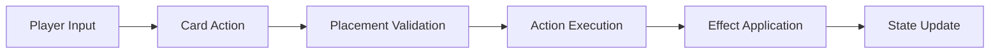
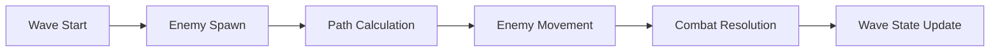

# System Patterns

## Architecture Overview

### Scene Architecture
```
Root (Node2D)
├── GridManager
│   ├── TileMap
│   └── PlacementIndicator
├── UnitManager
│   ├── Characters
│   ├── Enemies
│   └── Projectiles
├── MainTower
│   ├── Sprite
│   ├── CollisionShape2D
│   └── HealthComponent
├── WaveManager
│   └── SpawnPoints
└── UI (CanvasLayer)
    ├── HUD
    ├── CardSystem
    └── GameOver
```

### Core Systems

## 1. Grid System
- Pattern: Singleton Manager
- Implementation: GridManager autoload
- Responsibilities:
  - Grid coordinate management
  - Unit placement validation
  - Pathfinding calculations
  - Visual feedback handling

## 2. Card System
- Pattern: State Machine + Observer
- Implementation: CardManager autoload
- Key Components:
  - Deck state management
  - Hand management
  - Resource tracking
  - Card action resolution

## 3. Unit Management
- Pattern: Component-based Architecture
- Base Components:
  - HealthComponent
  - CombatComponent
  - MovementComponent
  - AbilityComponent
- Inheritance Structure:
  ```
  BaseUnit
  ├── PlayerUnit
  │   ├── StaticDefender
  │   ├── MobileUnit
  │   └── SupportUnit
  └── EnemyUnit
      ├── BasicEnemy
      ├── EliteEnemy
      └── BossEnemy
  ```

## 4. Wave System
- Pattern: State Machine
- States:
  - Preparation
  - Spawning
  - Active
  - Completed
- Implementation:
  - Wave configuration data
  - Spawn point management
  - Difficulty scaling
  - Progress tracking

## 5. Combat System
- Pattern: Component + Observer
- Core Mechanics:
  - Attack resolution
  - Damage calculation
  - Projectile management
  - Effect application

## 6. Save System
- Pattern: Repository + Serialization
- Data Categories:
  - Run progress
  - Meta progression
  - Player preferences
  - Statistics

## Design Patterns in Use

### 1. Singleton Pattern
Used for global managers:
- GameState
- GridManager
- CardManager
- AudioManager

### 2. Component Pattern
Used for unit functionality:
- Health
- Combat
- Movement
- Effects

### 3. Observer Pattern
Used for system communication:
- Unit state changes
- Combat events
- Wave progression
- Card actions

### 4. State Machine Pattern
Used for:
- Game states
- Wave management
- Unit behavior
- Card states

### 5. Command Pattern
Used for:
- Card actions
- Unit abilities
- Player inputs
- Game commands

## Data Flow

### Combat Flow


### Wave Flow


## Performance Considerations

### Memory Management
- Object pooling for projectiles
- Efficient scene instantiation
- Resource preloading
- Cache management

### Rendering Optimization
- Culling for off-screen units
- Batch processing
- Particle system limits
- Shader optimization

### Mobile Considerations
- Touch input responsiveness
- Battery usage optimization
- Memory footprint management
- State persistence